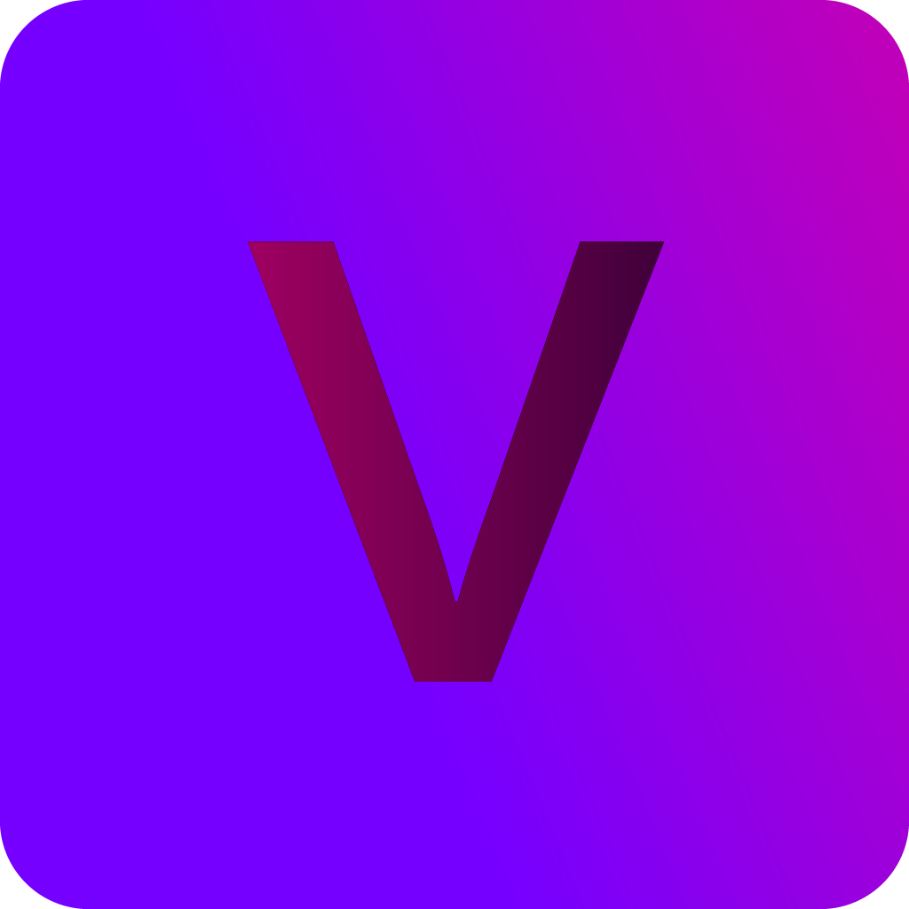

# Contributing to Voxel



Thanks for helping improve Voxel!

## Ground rules

- Keep changes focused and minimal.
- Preserve the current stack (FastAPI + static frontend + local model tooling) unless a maintainer requests otherwise.
- Prefer local-first behavior and privacy-conscious defaults.
- Do not commit secrets, keys, model weights, generated audio, or local logs/databases.

## Development setup

```powershell
python -m venv .venv
.\.venv\Scripts\Activate.ps1
pip install -r requirements.txt
```

Run locally:

```powershell
.\run.ps1
```

## Before opening a PR

1. Ensure the app still starts.
2. Run at least a lightweight sanity check:

```powershell
python -m compileall app
```

3. If tests exist for your change area, run them and include results.
4. Update docs when behavior, endpoints, setup, or workflows change.
5. Keep PR scope tight (avoid mixed unrelated refactors).

## Pull request expectations

- Use the PR template.
- Explain **what changed** and **why**.
- Call out user-visible behavior changes.
- Mention risks and rollback approach for non-trivial changes.
- Reference linked issues when applicable.

## Code style

- Match existing style and naming in surrounding files.
- Avoid introducing new frameworks or architecture without explicit approval.
- Keep comments practical; do not add noise.

## Security and vulnerabilities

Do not open public issues for sensitive vulnerabilities.

Use [SECURITY.md](SECURITY.md) for responsible disclosure guidance.
